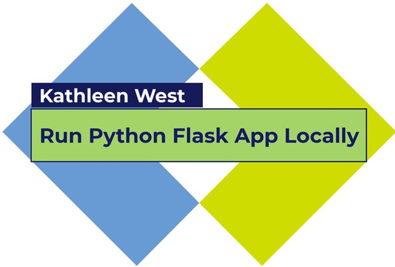

# Azure Virtual Machine Web App Demo Project
 
 This is a tutorial azure cloud project that demonstrates how to install a basic web app on a virtual machine. We will use our azure account to creature a resource group and virtual machine. Then we will install and configure the virtual machine to run nginx and python web applications. Our web app is a flask template web application that is uploaded to our virtual machine and then configured to run with nginx.
 
 Watch the video tutorials and follow step-by-step instructions to learn how to create your own starter web app running on an azure cloud virtual machine.
 

